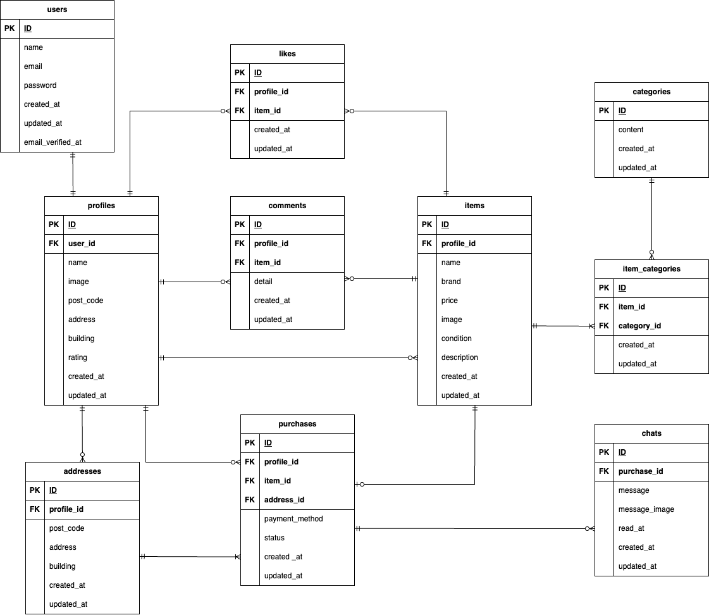

# COACHTECH フリマアプリ

## 環境構築

### Dockerビルド
* git clone [git@github.com:ri0921/flea-market.git](https://github.com/ri0921/flea-market)
* docker-compose up -d --build

### Laravel環境構築
* docker-compose exec php bash
* composer install
* cp .env.example .env  環境変数を変更
* php artisan key:generate
* (composer require laravel/fortify)
* (php artisan vendor:publish --provider="Laravel\Fortify\FortifyServiceProvider")
* (composer require laravel-lang/lang:~7.0 --dev)
* (php artisan storage:link)画像出てこなかったら書く
* php artisan migrate
* php artisan db:seed
* composer require stripe/stripe-php
* .envにStripeキーを追加

## 使用技術
* PHP 7.4.9
* Laravel 8.83.8
* MySQL 8.0.26
* Stripe ^17.1

## ER図

## URL
* 開発環境：[http://localhost/](http://localhost/)
* phpMyadmin：[http://localhost:8080/](http://localhost:8080/)