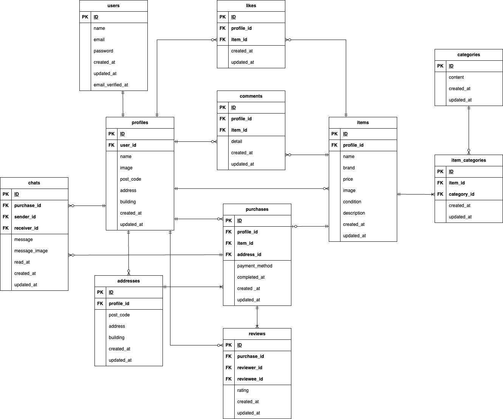

# coachtechフリマ

## 概要

「coachtechフリマ」は、ある企業が開発した独自のフリマアプリです。
10〜30代の社会人をターゲットに、誰でも簡単にアイテムの出品・購入ができることを目的としています。

- **目標**：初年度でユーザー数 1,000人の達成
- **特徴**
  - 出品・購入機能
  - ユーザー認証（Fortify）
  - Stripe による決済機能
  - 開発用メール確認（MailHog）
- **使用技術**：Laravel / Fortify / MySQL / Stripe / Docker

---

## 環境構築

### Dockerビルド
* リポジトリをクローン
```
git clone git@github.com:ri0921/flea-market.git
```
* Dockerをビルド
```
docker-compose up -d --build
```

### Laravel環境構築
* PHPコンテナに入る
```
docker-compose exec php bash
```
* Laravelパッケージのインストール
```
composer install
```
* vendor/stripe/stripe-php ディレクトリが生成されていなければStripeライブラリのインストール
```
composer require stripe/stripe-php
```
* config確認
* .envファイル作成、環境変数を変更、基本設計書記載のAPIキーを追加
```
cp .env.example .env
```
* アプリケーションキーの生成
```
php artisan key:generate
```
* マイグレーションの実行
```
php artisan migrate
```
* シーダーの実行
```
php artisan db:seed
```
* ストレージリンクの作成
```
php artisan storage:link
```
* MailHogの起動
```
docker run -d -p 1025:1025 -p 8025:8025 mailhog/mailhog
```
* テスト用データベースdemo_testがあるか確認、なければ追記
* テスト用アプリケーションキーの生成
```
php artisan key:generate --env=testing
```
* テスト用マイグレーションの実行
```
php artisan migrate --env=testing
```

## ログイン情報

`php artisan db:seed` を実行すると、テスト用ユーザーが自動的に作成されます。  
一般ユーザーの情報（メールアドレスなど）は `UserFactory` によって**ランダムに生成されるため、毎回異なります**。  
ユーザー情報はデータベースで確認できます。

## 使用技術
* PHP 7.4.9
* Laravel 8.83.8
* MySQL 8.0.26
* Stripe 17.1.1
* MailHog 1.0.1

## ER図


## URL
* 開発環境：<http://localhost/>
* phpMyadmin：<http://localhost:8080/>
* MailHog：<http://localhost:8025/>
